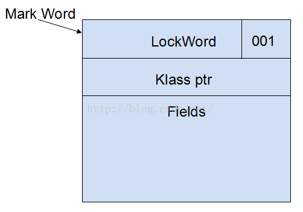
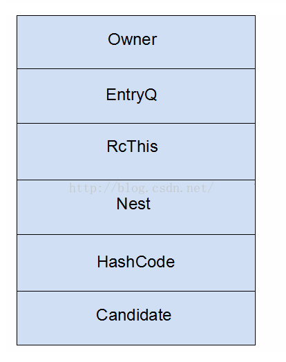

转	

#### [Synchronize实现原理（很难）](https://blog.csdn.net/zbuger/article/details/51030772)

2016年03月31日 22:25:15 zbuger 阅读数：4218更多
个人分类： java jvm java

在C程序代码中我们可以利用操作系统提供的互斥锁来实现同步块的互斥访问及线程的阻塞及唤醒等工作。然而在Java中除了提供Lock API外还在语法层面上提供了synchronized关键字来实现互斥同步原语。那么到底在JVM内部是怎么实现synchronized关键子的呢？

#### 一、synchronized的字节码表示： 

      在java语言中存在两种内建的synchronized语法：1、synchronized语句；2、synchronized方法。对于synchronized语句当Java源代码被javac编译成bytecode的时候，会在同步块的入口位置和退出位置分别插入monitorenter和monitorexit字节码指令。而synchronized方法则会被翻译成普通的方法调用和返回指令如:invokevirtual、areturn指令，在VM字节码层面并没有任何特别的指令来实现被synchronized修饰的方法，而是在Class文件的方法表中将该方法的access_flags字段中的synchronized标志位置1，表示该方法是同步方法并使用调用该方法的对象或该方法所属的Class在JVM的内部对象表示Class做为锁对象。

#### 二、JVM中锁的优化：

      简单来说在JVM中monitorenter和monitorexit字节码依赖于底层的操作系统的Mutex Lock来实现的，但是由于使用Mutex Lock需要将当前线程挂起并从用户态切换到内核态来执行，这种切换的代价是非常昂贵的；然而在现实中的大部分情况下，同步方法是运行在单线程环境（无锁竞争环境）如果每次都调用Mutex Lock那么将严重的影响程序的性能。不过在jdk1.6中对锁的实现引入了大量的优化，如锁粗化（Lock Coarsening）、锁消除（Lock Elimination）、轻量级锁（Lightweight Locking）、偏向锁（Biased Locking）、适应性自旋（Adaptive Spinning）等技术来减少锁操作的开销。

锁粗化（Lock Coarsening）： 也就是减少不必要的紧连在一起的unlock，lock操作，将多个连续的锁扩展成一个范围更大的锁。

锁消除（Lock Elimination）： 通过运行时JIT编译器的逃逸分析来消除一些没有在当前同步块以外被其他线程共享的数据的锁保护，通过逃逸分析也可以在线程本地Stack上进行对象空间的分配（同时还可以减少Heap上的垃圾收集开销）。

轻量级锁（Lightweight Locking）： 这种锁实现的背后基于这样一种假设，即在真实的情况下我们程序中的大部分同步代码一般都处于无锁竞争状态（即单线程执行环境），在无锁竞争的情况下完全可以避免调用操作系统层面的重量级互斥锁，取而代之的是在monitorenter和monitorexit中只需要依靠一条CAS原子指令就可以完成锁的获取及释放。当存在锁竞争的情况下，执行CAS指令失败的线程将调用操作系统互斥锁进入到阻塞状态，当锁被释放的时候被唤醒（具体处理步骤下面详细讨论）。

偏向锁（Biased Locking）： 是为了在无锁竞争的情况下避免在锁获取过程中执行不必要的CAS原子指令，因为CAS原子指令虽然相对于重量级锁来说开销比较小但还是存在非常可观的本地延迟（可参考这篇 文章 ）。

适应性自旋（Adaptive Spinning）： 当线程在获取轻量级锁的过程中执行CAS操作失败时，在进入与monitor相关联的操作系统重量级锁（mutex semaphore）前会进入忙等待（Spinning）然后再次尝试，当尝试一定的次数后如果仍然没有成功则调用与该monitor关联的semaphore（即互斥锁）进入到阻塞状态。

#### 三、对象头（Object Header）：

在JVM中创建对象时会在对象前面加上两个字大小的对象头，在32位机器上一个字为32bit，根据不同的状态位Mark World中存放不同的内容，如上图所示在轻量级锁中，Mark Word被分成两部分，刚开始时LockWord为被设置为HashCode、最低三位表示LockWord所处的状态，初始状态为001表示无锁状态。Klass ptr指向Class字节码在虚拟机内部的对象表示的地址。Fields表示连续的对象实例字段。

#### 四、Monitor Record：

  Monitor Record是线程私有的数据结构，每一个线程都有一个可用monitor record列表，同时还有一个全局的可用列表；那么这些monitor record有什么用呢？每一个被锁住的对象都会和一个monitor record关联（对象头中的LockWord指向monitor record的起始地址，由于这个地址是8byte对齐的所以LockWord的最低三位可以用来作为状态位），同时monitor record中有一个Owner字段存放拥有该锁的线程的唯一标识，表示该锁被这个线程占用。如下图所示为Monitor Record的内部结构： 

- 
  **Owner：**初始时为NULL表示当前没有任何线程拥有该monitor record，当线程成功拥有该锁后保存线程唯一标识，当锁被释放时又设置为NULL；

- **EntryQ:**关联一个系统互斥锁（semaphore），阻塞所有试图锁住monitor record失败的线程。

- **RcThis:**表示blocked或waiting在该monitor record上的所有线程的个数。

- **Nest:**用来实现重入锁的计数。

- **HashCode:**保存从对象头拷贝过来的HashCode值（可能还包含GC age）。

- **Candidate:**用来避免不必要的阻塞或等待线程唤醒，因为每一次只有一个线程能够成功拥有锁，如果每次前一个释放锁的线程唤醒所有正在阻塞或等待的线程，会引起不必要的上下文切换（从阻塞到就绪然后因为竞争锁失败又被阻塞）从而导致性能严重下降。Candidate只有两种可能的值0表示没有需要唤醒的线程1表示要唤醒一个继任线程来竞争锁。

#### 五、轻量级锁具体实现：

#####  一个线程能够通过两种方式锁住一个对象：

​	1、通过膨胀一个处于无锁状态（状态位001）的对象获得该对象的锁；

​	2、对象已经处于膨胀状态（状态位00）但LockWord指向的monitor record的Owner字段为NULL，则可以直接通过CAS原子指令尝试将Owner设置为自己的标识来获得锁。

##### 获取锁（monitorenter）的大概过程如下：

​	（1）当对象处于无锁状态时（RecordWord值为HashCode，状态位为001），线程首先从自己的可用moniter record列表中取得一个空闲的moniter record，初始Nest和Owner值分别被预先设置为1和该线程自己的标识，一旦monitor record准备好然后我们通过CAS原子指令安装该monitor record的起始地址到对象头的LockWord字段来膨胀(原文为inflate，我觉得之所以叫inflate主要是由于当对象被膨胀后扩展了对象的大小；为了空间效率，将monitor record结构从对象头中抽出去，当需要的时候才将该结构attach到对象上，但是和这篇 Paper 有点互相矛盾，两种实现方式稍微有点不同)该对象，如果存在其他线程竞争锁的情况而调用CAS失败，则只需要简单的回到monitorenter重新开始获取锁的过程即可。 

​	（2）对象已经被膨胀同时Owner中保存的线程标识为获取锁的线程自己，这就是重入（reentrant）锁的情况，只需要简单的将Nest加1即可。不需要任何原子操作，效率非常高。

​	（3）对象已膨胀但Owner的值为NULL，当一个锁上存在阻塞或等待的线程同时锁的前一个拥有者刚释放锁时会出现这种状态，此时多个线程通过CAS原子指令在多线程竞争状态下试图将Owner设置为自己的标识来获得锁，竞争失败的线程在则会进入到第四种情况（4）的执行路径。

​	（4）对象处于膨胀状态同时Owner不为NULL(被锁住)，在调用操作系统的重量级的互斥锁之前先自旋一定的次数，当达到一定的次数时如果仍然没有成功获得锁，则开始准备进入阻塞状态，首先将rfThis的值原子性的加1，由于在加1的过程中可能会被其他线程破坏Object和monitor record之间的关联，所以在原子性加1后需要再进行一次比较以确保LockWord的值没有被改变，当发现被改变后则要重新进行monitorenter过程。同时再一次观察Owner是否为NULL，如果是则调用CAS参与竞争锁，锁竞争失败则进入到阻塞状态。

##### 释放锁（monitorexit）的大概过程如下：

​	（1）首先检查该对象是否处于膨胀状态并且该线程是这个锁的拥有者，如果发现不对则抛出异常；

​	（2）检查Nest字段是否大于1，如果大于1则简单的将Nest减1并继续拥有锁，如果等于1，则进入到（3）；

​	（3）检查rfThis是否大于0，设置Owner为NULL然后唤醒一个正在阻塞或等待的线程再一次试图获取锁，如果等于0则进入到（4）

​	（4）缩小（deflate）一个对象，通过将对象的LockWord置换回原来的HashCode值来解除和monitor record之间的关联来释放锁，同时将monitor record放回到线程是有的可用monitor record列表。