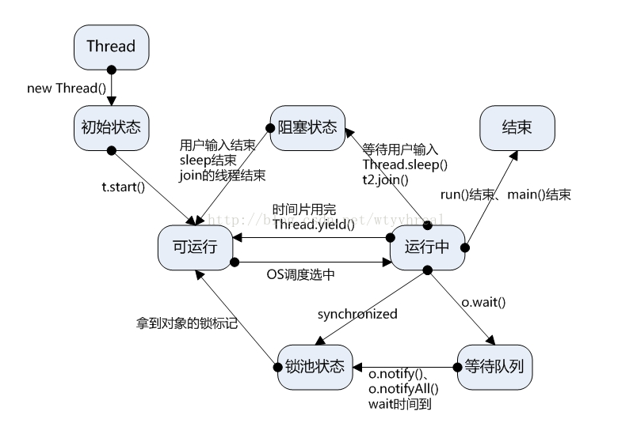

 

#### Thread类中的方法

**静态方法** sleep() : 线程休眠 放弃时间片 但不释放锁 

**静态方法** yield() : 放弃当前的CPU资源 放弃的时间不确定 可能刚放弃又获得了

**非静态** interrupted() : 测试当前线程是否已经是中断状态，执行后具有将状态标志置清除为false的功能 

**非静态** isInterrupted () : 测试线程是否是中断状态，不清除状态标志

**非静态** interrupt() : 中断当前线程 调用一个线程的interrupt() 方法中断一个线程，并不是强行关闭这个线程，只是跟这个线程打个招呼，将线程的中断标志位置为true，线程是否中断，由线程本身决定 。

**非静态** other.join() : 内部调用了wait方法 被join的线程会释放锁 

**非静态** isAlive() : 判断当前线程是否处于活动状态

**非静态** **弃用** suspend() : 线程暂停 容易导致死锁 

**非静态** **弃用** resume() : 唤醒暂停中的线程

**非静态** **弃用** stop() : 强行结束线程并释放锁 可能产生不可预料的结果 会导致线程不会正确释放资源 

中断处于sleep状态的线程，会抛出InterruptedException异常。

已中断的线程尝试sleep，也会抛出InterruptedException异常。

如果要停止正在运行中的线程，可以调用interrupt()方法。但是并不会立即中断，中断后的语句还是有可能执行的，可以在接收到中断信号后，抛出异常。

#### 其他方法

wait() : 线程进入等待状态，立刻释放锁

notify() ： 唤醒一个处于等待状态中的锁  可能是随机的 也可能是优先级最高的线程 

notifyAll() : 唤醒所有处于等待状态中的锁

synchronized ： 对象监视器

volatile : 修饰变量的 保证变量在线程间传递的实时性